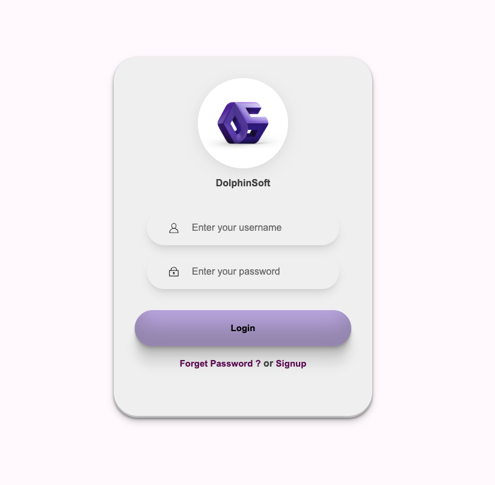

# Simple Login Form

This is a **simple login form** that I created using **HTML** and **CSS**.  
It demonstrates a clean and responsive design for a basic login interface.

## 🖼️ Preview

## 🚀 Features

- Clean and minimal design  
- Responsive layout  
- Easy to customize  
- Built only with HTML and CSS (no JavaScript)

## 💡 Usage

1. Clone or download this repository.  
2. Open the `index.html` file in your browser.  
3. Explore and modify the design as you like!

## 🛠️ Technologies Used

- **HTML5**  
- **CSS3**

## 📄 License

This project is open source and free to use for learning purposes.
